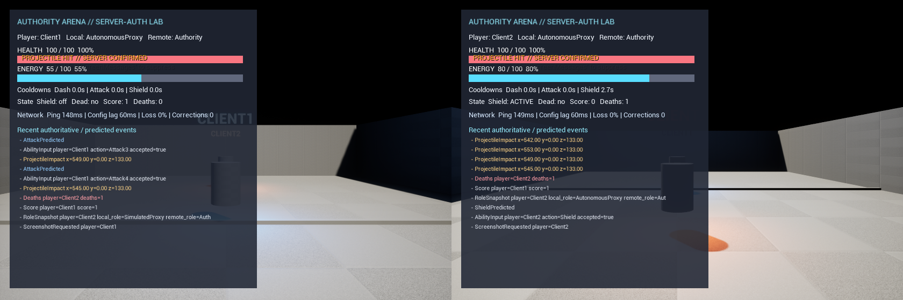

# AuthorityArena

AuthorityArena is a UE 5.8 C++ multiplayer engineering lab: two players fight in a generated third-person arena with native replication, Gameplay Ability System prediction, server-owned combat outcomes, adverse-network testing, and reproducible Win64 packaging.



| Question | Answer |
|---|---|
| **What it demonstrates** | CharacterMovement replication, ownership/roles, RepNotify, RPC validation, GAS Dash/Attack/Shield, damage, death, respawn, score, JSONL diagnostics, and packaging. |
| **Why it matters** | It turns common UE networking interview topics into executable C++ boundaries and evidence instead of a single-process visual mock-up. |
| **Run it** | Install UE 5.8, MSVC, PowerShell 7, and MQB 5.4; run the commands below from the repository root. |
| **Real multi-process evidence** | The committed reports came from one independent server process plus two independent client processes with distinct PIDs, run IDs, event streams, proxy roles, and bounded cleanup. |
| **Predicted locally** | Dash and Shield are `LocalPredicted`; Attack accepts predicted local input while projectile spawn/hit remains authority-only. |
| **Server authoritative** | Health, damage, Energy legality, cooldown legality, target/range checks, Death, Respawn, Score, and projectile creation. |
| **Known limits** | Epic's installed engine cannot build a Server target; Shipping blocks command-line URL overrides; see [Known Limitations](docs/KNOWN_LIMITATIONS.md). |
| **AI assistance** | Codex GPT-5.6 Sol produced the delivery under user-defined goals and constraints; this is not represented as independently hand-written work. |

## Run the verified paths

```powershell
# Portable rules core (MQB/MSVC)
pwsh -NoProfile -File .\scripts\Test-Core.ps1

# UE reflection and behavior tests
pwsh -NoProfile -File .\scripts\Build.ps1 -Target Editor -Configuration Development
pwsh -NoProfile -File .\scripts\Run-Automation.ps1

# Real Editor-Cmd server + two clients
pwsh -NoProfile -File .\scripts\RunMultiplayerScenario.ps1 `
  -Scenario Combat -NetworkProfile Baseline

# Full network and failure matrices
pwsh -NoProfile -File .\scripts\Invoke-NetworkMatrix.ps1
pwsh -NoProfile -File .\scripts\Invoke-FailureMatrix.ps1

# Local-only Win64 archive; Artifacts/ is ignored
pwsh -NoProfile -File .\scripts\Package-Win64.ps1 -Configuration Shipping
```

`scripts/Find-UE58.ps1` requires Unreal Engine 5.8. The tested Windows toolchain is UE 5.8.0 CL 55116800, UBT-selected MSVC 14.44, Windows SDK 26100, PowerShell 7.6, and MQB 5.4. Heavy binaries, Cook output, logs, and traces remain in ignored `Artifacts/`, `Binaries/`, `Intermediate/`, and `Saved/`.

## Architecture in one minute

`AAuthorityArenaGameMode` owns connection and Pawn lifecycle. `AAuthorityArenaGameState` replicates match/run timing. `AAuthorityArenaPlayerState` owns a Mixed-replication ASC, attributes, score, and deaths across respawns. `AAuthorityArenaCharacter` is the replaceable avatar and uses native CharacterMovement. The server alone spawns `AAuthorityArenaProjectile`, applies GameplayEffects, records death/score, and schedules one respawn. Multicast carries confirmed presentation only.

The PowerShell runner creates one bounded run directory and three process identities, validates JSONL schema/runId/role/sequence, asserts behavior, and cleans only exact owned PID/start-time/path triples. Network timing remains observational; functional assertions are the pass/fail contract.

## Evidence

- [Acceptance matrix](docs/ACCEPTANCE_MATRIX.md)
- [Testing and commands](docs/TESTING.md)
- [Architecture](docs/ARCHITECTURE.md), [network model](docs/NETWORK_MODEL.md), and [GAS design](docs/GAS_DESIGN.md)
- [Real multi-process runner](scripts/RunMultiplayerScenario.ps1)
- [Sanitized network matrix](docs/examples/network-matrix.json) and [failure matrix](docs/examples/failure-matrix.json)
- [Build and package boundary](docs/BUILD_SYSTEM.md)
- [AI assistance disclosure](docs/AI_ASSISTANCE.md)

## Portfolio use

Read the [code walkthrough](docs/CODE_WALKTHROUGH.md) and [interview guide](docs/INTERVIEW_GUIDE.md), then complete at least one [live change drill](docs/LIVE_CHANGE_DRILLS.md). The project deliberately favors a compact, inspectable vertical slice over production matchmaking, content scale, or anti-cheat claims.

## Release policy

Local packaging is mandatory, but no executable, DLL, Pak, log bundle, screenshot bundle, or other custom asset is uploaded to GitHub Releases. A `v0.1.0` release contains only GitHub-generated source archives. See [release notes](docs/RELEASE_NOTES_0.1.0.md).
