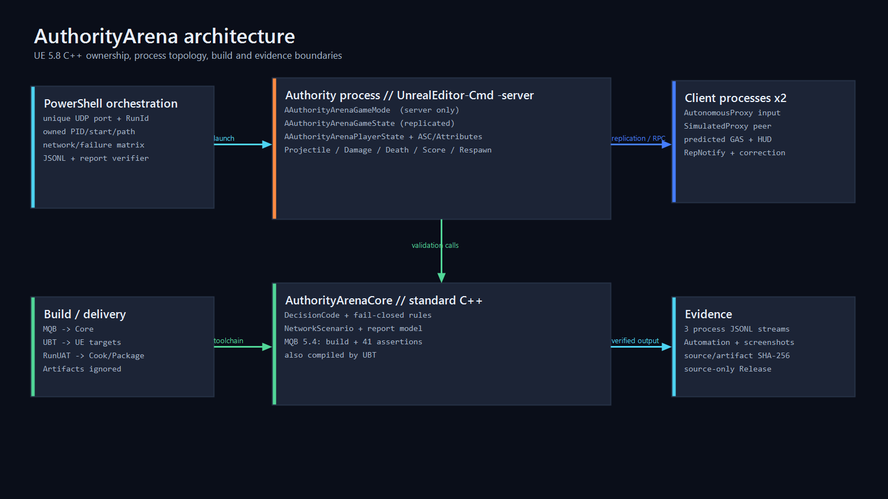

# Architecture

The approved technical blueprint is [`implementation_plan.md`](../tasks/20260904-224034-authority-arena-0.1/implementation_plan.md). This document reflects the verified P0 implementation; toolchain-specific departures are explicit rather than hidden.



```text
PowerShell scenario runner
  -> owned Editor runtime DedicatedServer or packaged Development ListenServer process
  -> owned client 1 process
  -> owned client 2 process
  -> JSONL streams and final consistency verifier

AuthorityArena UE module
  -> GameMode: server-only match and lifecycle authority
  -> GameState: replicated match phase/time/run identity
  -> PlayerState: replicated identity/score/deaths and persistent GAS state
  -> Character: CharacterMovement avatar and local input boundary
  -> Native GAS: predicted Dash, server-authoritative Projectile, replicated Shield
  -> Combat/Health: validation, damage, death and respawn boundaries
  -> Diagnostics/Automation: structured events and fixed scenarios
  -> C++ HUD/WorldBuilder: observable third-person graybox

AuthorityArenaCore standard C++ module
  -> stable request decisions
  -> rate/resource/target checks
  -> network scenario configuration
  -> final snapshot consistency
```

## Ownership summary

GameMode exists only on the server. GameState and PlayerState are server-written replicated state. The PlayerState owns the ASC and attributes so ability state survives Pawn replacement. Character owns only the current avatar, CharacterMovement, camera, and local input binding. The server alone spawns authoritative projectiles, applies damage, records death/score, and schedules one respawn. Multicast is presentation-only.

## Dependency direction

`AuthorityArenaCore` has no Unreal dependency. `AuthorityArena` depends on Core plus Engine, GameplayAbilities, GameplayTags, GameplayTasks, EnhancedInput, Json/JsonUtilities, Slate and UMG as required. PowerShell consumes process outputs but cannot mutate game state directly.

## Delivery topology

The Epic-installed engine can build Editor and Game but rejects `TargetType.Server`. The primary matrix therefore uses `UnrealEditor-Cmd -server -nullrhi`, which reports `NM_DedicatedServer`. Packaged Shipping is built and launched as a standalone release-like artifact. URL-driven packaged E2E uses Development because UE Shipping clears startup map/connection URL overrides by default; its ListenServer host Pawn is removed only under an explicit automation flag so Client1 and Client2 keep the two-Pawn arena geometry.
