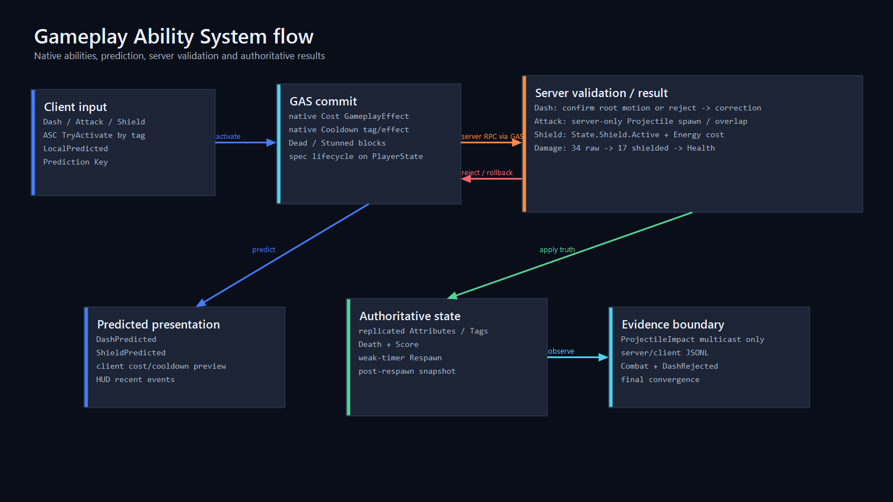

# Gameplay Ability System Design



## Ownership and lifecycle

`AAuthorityArenaPlayerState` owns the replicated `UAuthorityArenaAbilitySystemComponent` and `UAuthorityArenaAttributeSet`. The ASC uses `EGameplayEffectReplicationMode::Mixed`; PlayerState remains owned by its PlayerController and survives Pawn replacement. `AAuthorityArenaCharacter` is the avatar and implements `IAbilitySystemInterface` by returning the PlayerState ASC.

Both `PossessedBy` on authority and `OnRep_PlayerState` on clients call:

```text
InitAbilityActorInfo(PlayerState, Character)
```

Authority then grants the three native ability classes only when a matching spec does not already exist. Respawn reuses the same ASC/specs, clears `State.Dead`, restores Health/Energy through ASC attribute APIs, and assigns the new Character avatar. This prevents duplicate specs across Pawn replacement.

## Attributes and effects

| Attribute | Default | Replication | Authority rule |
|---|---:|---|---|
| Health / MaxHealth | 100 / 100 | RepNotify | final Health changes only through server GameplayEffects/reset |
| Energy / MaxEnergy | 100 / 100 | RepNotify | costs commit through GAS; server reset on respawn |
| IncomingDamage | 0 | meta, not replicated | server-only projectile effect input; cleared after execution |

All tuning effects are native C++ `UGameplayEffect` classes:

- Dash cost 25 Energy; cooldown 1.25 s.
- Attack cost 5 Energy; cooldown 0.45 s.
- Shield cost 20 Energy; cooldown 3 s; active state 2 s.
- Projectile damage writes 34 to IncomingDamage.

GameplayEffect target-tag components are native named default subobjects. This is required in UE 5.8: calling dynamic `FindOrAddComponent` during a GameplayEffect CDO constructor crashes because its empty-name `NewObject` path is invalid for default subobjects.

`ComputeMitigatedDamage` fails closed for negative/NaN values. A valid 34 hit becomes 17 while `State.Shield.Active` is present and remains 34 otherwise. Health is clamped to `[0, MaxHealth]`; zero Health invokes the server-only HealthComponent death path once.

## Native tags

- Abilities: `Ability.Dash`, `Ability.Attack`, `Ability.Shield`.
- State: `State.Dead`, `State.Stunned`, `State.Shield.Active`.
- Cooldowns: `Cooldown.Dash`, `Cooldown.Attack`, `Cooldown.Shield`.
- Stable failure observations: `Failure.Dead`, `Failure.Stunned`, `Failure.Resource`, `Failure.Cooldown`.

Ability asset tags are set through UE 5.8 `SetAssetTags` in C++ constructors. Dead/Stunned block all three abilities; active Shield also blocks Dash. Cooldown and Shield state tags are granted by GameplayEffects, not loose client-owned booleans.

## Dash prediction

`UGA_Dash` is `InstancedPerActor` and `LocalPredicted`. It commits a GameplayEffect cost and cooldown, then uses `UAbilityTask_ApplyRootMotionConstantForce`, which participates in UE CharacterMovement prediction/correction. The owning client logs `DashPredicted` with its Prediction Key; authority logs `DashConfirmed`.

The `DashRejected` automation path is controlled only by the server command line. The client receives no rejection gate and predicts from replicated Energy=100. During authority `CanActivateAbility`, the server-controlled one-shot gate changes authoritative Energy to 0 before the GAS cost check, appends `Failure.Resource`, and rejects. UE's Prediction Key path removes predicted cost/root motion; replicated Energy converges to 0. Real evidence requires final client and server position `x=-600` and Energy 0.

This is a reproducible validation injection, not a production anti-cheat claim and not a custom rollback protocol.

## Projectile Attack

`UGA_ProjectileAttack` accepts LocalPredicted input but only the authority branch calls `UAuthorityArenaCombatComponent::SpawnProjectileAuthority`. The client never provides damage. The server uses deferred spawn to record the replicated Projectile before close-range overlap can destroy it; world-space velocity disables `bInitialVelocityInLocalSpace` to avoid double rotation.

Only server overlap constructs `UAuthorityArenaGE_ProjectileDamage` and applies its spec to the target ASC. A bounded unreliable `MulticastImpact` carries presentation coordinates after the hit is authoritative; Health, Death and Score use replicated attributes/state rather than multicast side effects.

## Shield / Block

`UGA_Shield` is LocalPredicted. Commit applies native cost/cooldown effects and a 2-second duration effect granting `State.Shield.Active`. Damage reads the replicated GAS tag on authority and applies a fixed 0.5 multiplier. The C++ HUD derives Shield state from ASC tags; it does not maintain an independent truth.

## Verified scripted flow

All clients use a replicated `ScenarioStartServerTime`, derived from GameState's synchronized server clock, so independently loading processes act on one timeline:

```text
t=0.10 Client2 Shield predicted -> server confirmed
t=0.35 Client1 Dash predicted -> server confirmed
t=0.90 Attack 1 -> Projectile -> 34 raw / 17 applied
t=2.40 Attack 2 -> 34 applied
t=3.00 Attack 3 -> 34 applied
t=3.60 Attack 4 -> Health 0 -> Deaths/Score -> Pawn respawn
```

Automation tests lock the CDO/reflection contract, native tags, cost/cooldown classes, Mixed ASC ownership, attributes, shield damage function, projectile replication, and required C++ components. Multi-process evidence verifies prediction/confirmation, server-only spawn/hit/damage, shield mitigation, death/score/respawn and rejection correction. Clean-commit report paths are recorded in the acceptance matrix after the final rerun.
