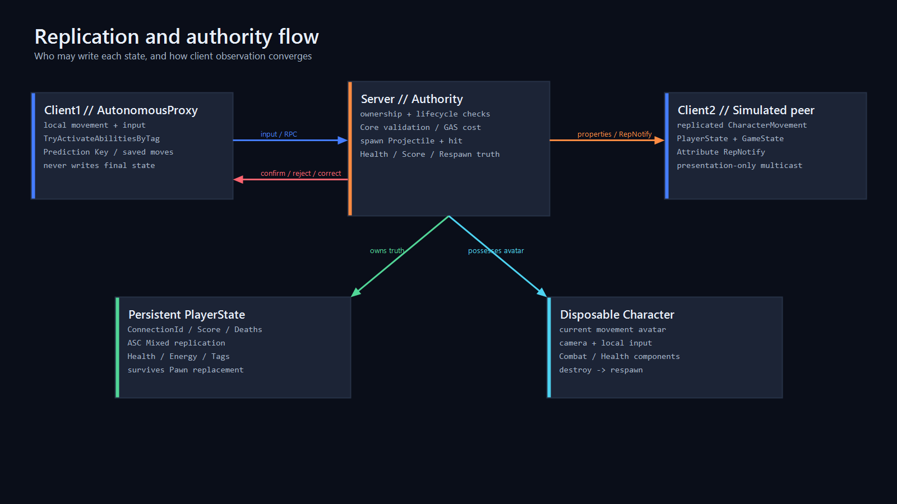

# Network Model



## Runtime topology

AuthorityArena uses Unreal's native client/server model. The installed Epic UE 5.8 distribution cannot build a `TargetType.Server` binary, so local evidence runs an independent `UnrealEditor-Cmd` Game process with `-server -nullrhi`. That process has `NM_DedicatedServer` runtime behavior, but the repository does not claim that a Dedicated Server target binary was built.

```text
server process (authority, no local player)
  <- CharacterMovement/RPC input -- client 1 (AutonomousProxy for self)
  <- CharacterMovement/RPC input -- client 2 (AutonomousProxy for self)
  -> replicated actors/state ----- both clients (SimulatedProxy for peer)
```

The packaged Development variant is a ListenServer Game process because the installed distribution has no Server target. Its explicit automation flag unpossesses and destroys the local host Pawn before remote clients join. The PlayerController/PlayerState remain engine-owned host bookkeeping, but authority snapshots and combat contain only Client1 and Client2. Shipping packaging is independently built/launched and is not used for URL-driven client connection because UE disables that command-line override by default.

## Object ownership

| Object | Exists on server | Replicates to clients | Authoritative data |
|---|---:|---:|---|
| `AAuthorityArenaGameMode` | yes | no | spawn selection, connection lifecycle, match transitions |
| `AAuthorityArenaGameState` | yes | yes | match phase, remaining seconds, scenario run ID |
| `AAuthorityArenaPlayerController` | owning connection | owner only | validated client request boundary |
| `AAuthorityArenaPlayerState` | yes | yes | connection ID, display name, score, deaths; GAS state in PACT-20 |
| `AAuthorityArenaCharacter` | yes | yes | current Pawn/avatar and CharacterMovement state |
| `UAuthorityArenaAutomationDriver` | C++ default subobject | class subobject on every replica | test input only; no authoritative gameplay mutation |
| `AAuthorityArenaWorldBuilder` | server spawned | yes | fixed graybox components and collision |

PlayerState owns information that must survive Pawn death/replacement. Character owns only current-avatar movement, presentation, and local input bindings. GameMode never exists on clients.

## Replication and RepNotify

GameState uses RepNotify for `MatchPhase`, `RemainingSeconds`, and `ScenarioRunId`. PlayerState uses RepNotify for `ConnectionId`, `DisplayName`, `ScoreValue`, and `DeathCount`. Server-side setters reject non-authority calls and invoke the same observation function locally so server/client diagnostic streams have comparable events.

Character movement and rotation use `ACharacter`/`UCharacterMovementComponent` native prediction, server reconciliation, and replication. AuthorityArena does not implement a second movement protocol.

## RPC contract

- Reliable Server RPC: `ServerRequestRespawn`. PACT-10 rejects a living player's request; PACT-30 adds the complete death/respawn gate.
- Unreliable Server RPC: `ServerReportViewSample`. It accepts only increasing sequence numbers and finite rotations, records diagnostics, and never affects hit, damage, Health, movement, or Score.
- Reliable Client RPC: `ClientRequestRejected`, carrying action and stable reason names to the owning client.
- Multicast: reserved for a server-confirmed, presentation-only projectile impact in PACT-20. Authoritative values are replicated properties/effects rather than multicast side effects.

## Verified PACT-10 behavior

The `ConnectionMovement` scenario creates a unique UDP port and RunId, launches one server and two client PIDs, waits for the real `IpNetDriver` listener and server Ready event, then has both owning clients submit movement through CharacterMovement. Each client logs its own `AutonomousProxy` and its peer's `SimulatedProxy`; the server logs both characters as `Authority`. The server's final positions must be at least 100 Unreal units away from their configured spawn X values.

The runner records PID, start time, requested executable path, exit code, source HEAD, dirty state, assertions, and report path. Cleanup re-reads PID/start-time/path and refuses to terminate a mismatched process. Timing is observational; only connection, role, movement and exit assertions are functional requirements at this stage.

The `Lifecycle` scenario additionally sends a presentation-only, unreliable `MulticastMatchPulse`, destroys Client2's Pawn on authority, preserves its PlayerController/PlayerState, sends exactly one reliable respawn request from the owning controller, gates one respawn timer through a weak controller key, and captures two authority Pawns after replacement. Logout cancels any remaining per-controller respawn timer before the controller is released. The runner requires both explicit disconnect events and zero standalone fallback.
